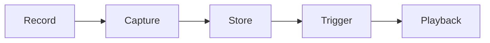

# keyboard-macro-controller ⌨️✨

  

*Record once, replay forever — your keystrokes, choreographed.*

  

---

## 🚀 Quick Start

1. **Grab it** — hit the download button below to reach the landing page.

2. **Unzip & run** — no installer wizard, no admin prompts, just double-click the executable.

3. **Hit record** — press your global hotkey, perform the actions once, press it again to stop. That's your first macro. 🎉

> [!TIP]
> Pin the app to your taskbar after the first run — you'll be reaching for it more than you expect.

---

## 🧭 Overview

**keyboard-macro-controller** is a lightweight Windows-native keyboard macro player built for people who repeat the same sequence of keystrokes more times than they'd like to admit. Whether you're grinding through repetitive data-entry forms, automating test input sequences, speed-running in-game combos, or just tired of typing the same boilerplate text a hundred times a day — this tool exists to record what your fingers do and hand that job back to your keyboard.

The project sits in a specific niche: it's not a full RPA suite, and it's not a scripting language you need a manual for. It's a **keyboard macro player** in the purest sense — press record, do the thing, press stop, and replay it whenever you want, as many times as you want, at whatever speed you want. We built it because most "macro tools" out there are either bloated automation platforms that require a computer science degree to configure, or sketchy standalone `.exe` files with zero transparency about what they're actually doing to your system.

Who is this for? Power users who live inside the same 5 applications every day. Developers testing repetitive UI flows. Streamers who need consistent input timing. Anyone who has ever thought "I wish my keyboard could just remember this for me." If that's you, welcome home.

---

## 🎛️ What It Actually Does

| Capability | The Fresh Angle |
|---|---|
| **Precision Recording** | Captures every keydown, keyup, and pause with millisecond-accurate timing — your macro replays with the *rhythm* of the original, not just the sequence. |
| **Infinite Loop Mode** | Set a macro to repeat N times or forever until you tap the kill-switch hotkey — great for long-running repetitive tasks that would otherwise chain you to your desk. |
| **Multi-Macro Library** | Save unlimited macros, name them, tag them, and switch between them without re-recording a single keystroke. |
| **Adjustable Playback Speed** | Slow down a macro to debug it, or speed it up 5x to blast through repetitive input in seconds. |
| **Global Hotkey Binding** | Trigger any saved macro from anywhere on your system — no need to keep the app window focused. |
| **Human Timing Jitter** | Optional randomized micro-delays between keystrokes so playback doesn't feel like a metronome. |
| **Import / Export Macros** | Share a macro file with a teammate or back it up before wiping your machine. |
| **Zero Background Bloat** | Sits quietly in your system tray sipping almost no CPU until you actually call on it. |

> [!NOTE]
> All macros are stored locally on your machine. Nothing is uploaded, synced, or phoned home. What you record stays yours.

---

## 🧩 Getting Started (The Real Steps)

<strong>Click to expand the full walkthrough</strong>

1. Visit the landing page via the download badge above.

2. Download the latest build — it's a single portable package, no installer required.

3. Extract it anywhere (Desktop, a tools folder, a USB stick — your call).

4. Launch the executable. The tray icon confirms it's running. Set your first hotkey in **Settings → Hotkeys** and you're live.

---

## 💻 System Requirements

| Requirement | Details |
|---|---|
| **OS** | Windows 10 or Windows 11 (64-bit) |
| **Dependencies** | None — fully standalone, self-contained executable |
| **Disk Space** | Under 50 MB |
| **RAM** | Negligible — runs happily alongside everything else you have open |
| **Permissions** | Standard user permissions; no admin rights needed for normal use |

  

---

## ⚙️ How It Works

The engine behind keyboard-macro-controller is intentionally simple — three moving parts, no magic:

1. **Hook** — a low-level keyboard hook listens system-wide for input events.

2. **Capture** — while recording, every event gets timestamped and pushed into a macro buffer.

3. **Store** — the buffer is serialized into a macro file, saved to your local library.

4. **Playback** — on trigger, the player reads the file back and re-emits synthetic keystrokes at the recorded timing.

> [!IMPORTANT]
> Playback uses synthetic input events, so it behaves like a real keyboard to almost all applications — but some games with strict anti-automation input filters may not register it. That's expected, not a bug.

---

## 🩹 Troubleshooting

**Q: My macro plays back but some keystrokes seem to be missing.**
A: Certain applications throttle rapid input. Try enabling **Human Timing Jitter** in Settings to space keystrokes out slightly.

**Q: The global hotkey isn't triggering my macro.**
A: Another application may already be using that key combination. Rebind it under **Settings → Hotkeys** to something unused.

**Q: Windows flagged the executable on first run.**
A: This is common for new, unsigned indie tools. Click "More info → Run anyway." We're working toward code-signing in a future release.

**Q: Can I edit a macro after recording it?**
A: Yes — open it in the **Macro Editor** to trim, reorder, or adjust the delay between individual keystrokes.

**Q: My recorded macro plays back too fast/slow in-game.**
A: Use the **Playback Speed** slider — many games render input timing differently under load, so a quick calibration pass usually fixes it.

**Q: Does this work across multiple monitors or virtual desktops?**
A: Yes, the keyboard hook operates system-wide regardless of window focus or monitor.

---

## 🎨 UI / UX Details

- **Themes**: Light, Dark, and an OLED-friendly true-black mode.

- **Tray-first design**: minimize to tray and keep working — the app never demands focus.

- **Shortcut reference:**

| Action | Default Shortcut |
|---|---|
| Start/Stop Recording | `Ctrl + Alt + R` |
| Play Active Macro | `Ctrl + Alt + P` |
| Stop All Playback | `Esc` (held) |
| Open Macro Library | `Ctrl + Alt + L` |

- **Settings panel** covers playback speed defaults, jitter range, startup behavior, and hotkey rebinding — all changes apply live, no restart needed.

> [!TIP]
> Use the "Stop All Playback" panic key generously while testing new macros — it's your safety net.

---

## 🤝 Contributing & Community

We love contributions of every size — typo fixes, feature ideas, bug reports, or full pull requests.

- Open an issue to report bugs or suggest features.

- Fork the repo, branch off, and submit a PR — we review actively.

- Join discussions to shape the roadmap for future versions.

> [!WARNING]
> Please don't submit macros intended to interact with anti-cheat protected environments or violate a third-party service's terms of use. This project is for productivity and personal automation, not for circumventing other software's rules.

---

## 📜 License

Released under the [MIT License](LICENSE), 2026. Use it, fork it, build on it — just keep the license notice intact.

---

## ⚠️ Disclaimer

keyboard-macro-controller is provided *as-is*, for personal productivity and automation purposes. The maintainers are not responsible for how the tool is used in third-party applications, games, or services — please respect the terms of service of any software you use it alongside.

---

## 📝 Changelog

<strong>v2026.3 — "Steady Hands"</strong>

- Added Human Timing Jitter for more natural playback

- Fixed a timing drift bug affecting macros longer than 10 minutes

- Improved tray icon responsiveness on Windows 11

<strong>v2026.2 — "Library Update"</strong>

- Introduced multi-macro library with tagging and search

- Added Import/Export for macro sharing

- Dark theme refinements

<strong>v2026.1 — "Initial Public Build"</strong>

- First public release of the keyboard macro player

- Core recording, playback, and hotkey binding implemented

- Light/Dark theme support added

---

